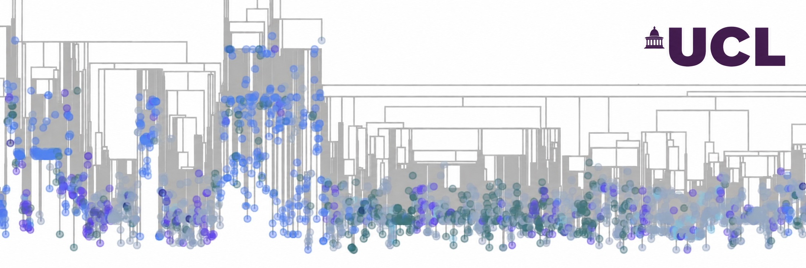

# van Dorp Microbial Genomics Group

We use genomic and computational approaches to study the evolution, epidemiology and population biology of microbial pathogens.

Our work combines microbial genomics, evolutionary biology, population genetics and computational methods to understand how pathogens emerge, spread and adapt.

## Research interests

- Microbial population genomics
- Pathogen evolution
- Genomic epidemiology
- Antimicrobial resistance
- Phylogenetics and phylodynamics
- Comparative genomics

## Repositories

This organisation hosts:

- Research software and analysis pipelines
- Code associated with publications
- Shared computational tools for lab members
- Training and tutorial material for lab members
- Internal lab documentation and resources

## Lab resources

Group members can find internal documentation, protocols, cluster information and tutorials in the private `lab-resources` repository.

## Group information

**Location:** UCL, London  
**Group meeting:** Tuesdays at 10:30am as part of the UGI Microbial Core Team

## Links

- **UCL group page:** https://www.homepages.ucl.ac.uk/~ucbpvan/
- **Publications:** https://scholar.google.com/citations?hl=en&user=t-9AxTcAAAAJ&view_op=list_works&sortby=pubdate
